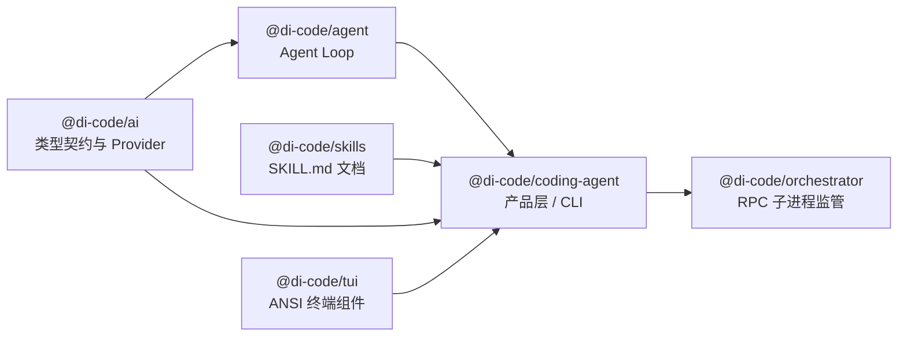
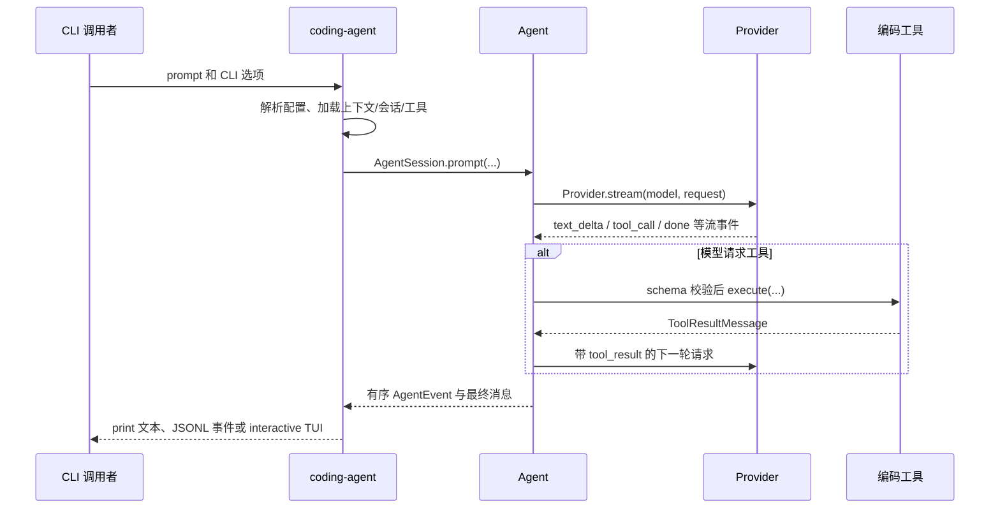
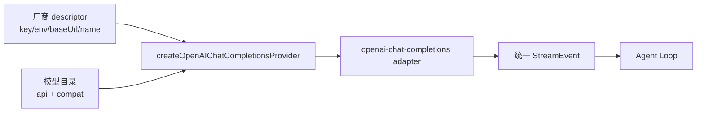

# di-code 开发教程

本文面向准备修改 **di-code 本仓库源码** 的开发者，说明如何建立本地环境、定位代码、以离线且确定的方式验证修改，并安全地扩展 Provider、Agent、编码工具、CLI 与终端 UI。

> 本文讨论的是仓库开发，不是终端用户使用手册。普通使用方法见根目录 `README.md`；编写本地插件见 [`插件使用指南.md`](./插件使用指南.md)。

## 1. 开发前的心智模型

`di-code` 是 npm workspaces 单仓库（monorepo）。每个 `packages/*` 目录都是独立的 ESM TypeScript 包；包之间只能沿下列依赖方向引用：



这个方向是重要约束：

- `ai` 不知道文件系统、命令行、会话或终端 UI；它只定义消息、工具、模型和流式事件，并适配远程 API。
- `agent` 不知道具体 Provider，也不直接读写文件或执行命令；它负责消息历史、工具调用循环、取消和事件顺序。
- `coding-agent` 是产品边界：它提供 CLI、会话、项目上下文、内置编码工具、插件和 interactive UI。
- `tui` 是可独立复用的 ANSI 组件库，**不得**依赖 AI、Agent 或 coding-agent。
- `orchestrator` 只经由公开的 `@di-code/coding-agent/rpc` 协议与子进程通信，不能导入 coding-agent 内部文件。

修改前先问自己：新行为属于哪一层？例如“模型流事件多一种字段”先改 `ai`；“遇到工具调用后怎样重试”属于 `agent`；“执行 PowerShell 命令的工作目录和超时”属于 `coding-agent`；“列表选择器如何画到终端”属于 `tui`。

## 2. 环境准备

### 2.1 前置条件

- Node.js **>= 22.19.0**；仓库使用 Node 的 TypeScript strip-types 开发运行方式。
- npm；不要使用 pnpm/yarn 改写 lockfile。
- PowerShell 7 或 Windows PowerShell。
- 真实 Provider 的 API Key **不是**开发测试的前置条件。常规验证必须使用 Faux Provider，避免网络费用和不稳定性。

从仓库根目录执行：

```powershell
Set-Location D:\pi\di-code
node --version
npm install --ignore-scripts
npm run check
npm test
```

`--ignore-scripts` 防止安装阶段执行依赖生命周期脚本。首次运行 `npm run check` 会依次执行 Biome 静态检查和根 TypeScript 类型检查；`npm test` 会运行所有 workspace 中定义的 Vitest 测试。

### 2.2 离线冒烟验证

先不要配置真实 key。使用内置 Faux Provider 走一遍 CLI：

```powershell
Set-Location D:\pi\di-code
$env:DI_CODE_PROVIDER = "faux"
npm run dev -- --print "用一句话确认离线开发环境正常。"
Remove-Item Env:DI_CODE_PROVIDER
```

预期是命令正常结束并打印 Faux Provider 的确定性回答。该命令通过 `packages/coding-agent/src/entry.ts` 启动，适合检查入口、配置加载和 CLI 主链路；它不是替代单元测试的手段。

## 3. 目录导航

```text
packages/
  ai/             公共 AI 契约、模型目录、Provider 适配器
  agent/          Agent 与模型—工具循环
  coding-agent/   CLI 产品、工具、会话、资源、扩展、RPC
  skills/         独立的 SKILL.md 解析、发现、目录和调用展开
  tui/            ANSI 终端渲染和交互组件
  orchestrator/   di-code-rpc 子进程 supervisor
scripts/          模型数据、版本和发布脚本
.docs/            本地运行时数据（不作为源码修改目标）
docs/             使用和开发文档
```

每个包通常按同一约定组织：

| 路径 | 职责 |
| --- | --- |
| `src/` | 可编辑的 TypeScript 源码；公共导出从 `src/index.ts` 汇总。 |
| `test/` | Vitest 测试，测试名应描述可观察行为。 |
| `dist/` | `npm run build` 的产物；不要手工修改。 |
| `package.json` | 包名、公开 exports、依赖和包级脚本。 |
| `README.md` | 已发布包的使用说明；公共 API 改动时一并更新。 |

几个高频入口：

| 目标 | 优先阅读的文件 |
| --- | --- |
| AI 消息、模型、工具、流定义 | `packages/ai/src/types.ts`、`packages/ai/src/index.ts` |
| OpenAI / Anthropic / DeepSeek / Zhipu 适配 | `packages/ai/src/providers/` 与 `packages/ai/src/api/` |
| Agent 事件与循环 | `packages/agent/src/types.ts`、`packages/agent/src/agent.ts`、`packages/agent/src/agent-loop.ts` |
| CLI 参数和启动 | `packages/coding-agent/src/cli.ts`、`startup.ts`、`entry.ts`、`main.ts` |
| 内置工具 | `packages/coding-agent/src/core/tools/` |
| 会话和压缩 | `packages/coding-agent/src/core/session/`、`core/session.ts` |
| interactive 模式 | `packages/coding-agent/src/modes/interactive*.ts` |
| 可插拔运行时 | `packages/plugin-runtime/`、`packages/plugin-loader/`、`packages/plugin-sdk/`、`packages/coding-agent/src/compositions.ts` |
| JSONL RPC | `packages/coding-agent/src/rpc/`、`rpc-entry.ts` |
| TUI 基础设施 | `packages/tui/src/` |
| 子进程监管 | `packages/orchestrator/src/` |
| Skill 文档能力 | `packages/skills/src/` 与 `packages/skills/test/` |

## 4. 从输入到输出：一次 prompt 的真实流程

以 `npm run dev -- --print "总结此项目"` 为例，数据流如下：



`Agent Loop` 的关键不变量是：一轮对话先追加 user message，再流式接收 assistant message；若 assistant 包含 `tool_call`，Agent 先校验参数、执行对应工具、把 `tool_result` 追加到历史，再向模型发起下一轮请求。直到没有工具调用、发生错误或取消，循环才结束。

因此：

1. Provider 只负责把供应商响应转为公共 `StreamEvent`，不能直接执行工具。
2. 工具参数不能相信模型输出，执行前必须经过 TypeBox schema 的运行时校验。
3. 工具错误不是进程崩溃：Agent 将其编码为 `isError: true` 的工具结果，允许模型看到并调整下一步。
4. 跨异步边界必须传递 `AbortSignal`；取消后不应继续启动新的网络请求或工具操作。

## 5. 推荐开发流程（RED → GREEN → REFACTOR）

每次改动选择**最靠近行为的包和测试文件**，而不是先跑全仓库测试。

### 第一步：定位并写失败测试（RED）

例如修改 `read` 工具，就先读 `packages/coding-agent/test/read-tool.test.ts` 与 `src/core/tools/read.ts`。为新行为新增一个断言，并只运行该文件：

```powershell
Set-Location D:\pi\di-code
npm exec vitest run packages/coding-agent/test/read-tool.test.ts
```

确认测试确实被收集且因为“尚未实现的预期行为”失败。若它因 import、fixture 或语法错误失败，先修正测试本身；这种失败不能证明需求。

### 第二步：最小实现（GREEN）

只改动让当前测试通过所需的源文件。不要在一个未覆盖的改动中顺便重命名大批符号或增加未来功能。然后重新执行同一条定向命令。

### 第三步：整理（REFACTOR）

测试通过后才提取重复、改善命名或整理结构；随后再次运行刚才的定向测试。若改动公共类型、公共导出、跨包调用或构建配置，还要运行：

```powershell
npm run check
npm run build
npm test
```

> `npm test` 的工作区脚本使用 `--passWithNoTests`。因此不能只看退出码；新测试应确认 Vitest 输出中实际收集到了期望的文件和测试数量。

### 常用定向命令

```powershell
# 单包全部测试
npm run test --workspace @di-code/agent
npm run test --workspace @di-code/ai
npm run test --workspace @di-code/coding-agent

# 单个测试文件
npm exec vitest run packages/agent/test/tool-loop.test.ts
npm exec vitest run packages/ai/test/openai-provider.test.ts
npm exec vitest run packages/coding-agent/test/rpc-protocol.test.ts

# 只检查格式/静态规则与类型
npm run check

# 构建所有公开包；它按依赖顺序构建
npm run build
```

## 6. 按模块扩展的正确位置

### 6.1 新增或修改 Provider

Provider 的公共数据模型在 `packages/ai/src/types.ts`。Provider 实现位于 `src/providers/`，具体 HTTP/SSE 格式转换放在 `src/api/`。实现时必须：

1. 将外部响应视为 `unknown`，先进行运行时校验再转为公共事件；不要用 `any` 绕过边界。
2. 仅输出既有的可辨识联合类型事件，例如 `text_delta`、`tool_call`、`done`、`error`；供应商私有字段不能泄漏给 `agent`。
3. 正确传入请求的 `AbortSignal`，并测试网络错误、畸形事件、工具参数和终止事件。
4. 使用 mock `fetch` 或 Faux Provider 编写确定性测试，不能让普通单元测试访问付费 API。现有 `*-smoke.test.ts` 是专门的边界验证，运行前应阅读其开关条件。

若需要改变 `Message`、`ToolDefinition` 或 `StreamEvent`，先评估所有 Provider、Agent、会话持久化和 JSON/RPC 消费方，而不只是修改一个适配器。

#### 新增模型厂商：先选协议，再加 descriptor

不要为每个厂商复制一套 HTTP/SSE adapter。先根据厂商文档确认它的实际 wire protocol（线上传输协议），再选择下表中的路线：

| 厂商接口 | 应复用或新增的 adapter | 典型 endpoint | 厂商差异放置位置 |
| --- | --- | --- | --- |
| OpenAI Chat Completions 兼容 | `openai-chat-completions.ts` | `/chat/completions` | Provider descriptor 与 `Model.chatCompletionsCompat` |
| OpenAI Responses 兼容 | `openai-responses.ts` | `/responses` | Provider descriptor 与 Responses compat |
| Anthropic Messages | `anthropic-messages.ts` | `/v1/messages` | Anthropic provider / adapter |
| 以上均不兼容 | 新建独立 adapter | 由厂商规定 | adapter 内部，不进入 Agent Loop |

DeepSeek、Zhipu 和今后任何兼容 Chat Completions 的厂商都应共享同一条链路：



这里的边界不能反过来：厂商名不是 API 名。`provider: "acme"` 描述由谁提供模型；`api: "openai-chat-completions"` 描述请求和 SSE 的格式。Agent、工具、会话和 TUI 只看到统一事件，绝不能增加 `if (provider === "acme")` 分支。

**路线 A：新增内建 Chat Completions 厂商。** 依次修改以下位置：

1. 在 `packages/ai/src/models.ts` 增加模型源数据，设置厂商 ID、`api: "openai-chat-completions"`、默认 `baseUrl`、输入能力、上下文/输出上限和成本。只在确有协议证据时声明 `chatCompletionsCompat`：

   ```ts
   {
     id: "acme-coder",
     name: "Acme Coder",
     provider: "acme",
     api: "openai-chat-completions",
     baseUrl: "https://api.acme.example/v1",
     input: ["text"],
     reasoning: true,
     chatCompletionsCompat: {
       maxTokensField: "max_tokens",
       supportsUsageInStreaming: true,
     },
     contextWindow: 128_000,
     maxOutputTokens: 16_384,
     cost: { input: 0, output: 0, cacheRead: 0, cacheWrite: 0 },
   }
   ```

   不要手改 `models.generated.ts`。源数据完成后运行：

   ```powershell
   Set-Location D:\pi\di-code
   node --experimental-strip-types packages/ai/src/models.ts
   ```

2. 新建 `packages/ai/src/providers/acme.ts`，把它做成通用 factory 的薄封装。它只能填写厂商 ID、显示名、凭据环境变量、endpoint 环境变量和默认 endpoint：

   ```ts
   import {
     createOpenAIChatCompletionsProvider,
     type OpenAIChatCompletionsProviderOptions,
   } from "./openai-chat-completions.ts";

   export function createAcmeProvider(options: OpenAIChatCompletionsProviderOptions = {}) {
     return createOpenAIChatCompletionsProvider({
       ...options,
       providerId: "acme",
       name: "Acme",
       apiKeyEnvironmentVariable: "ACME_API_KEY",
       baseUrlEnvironmentVariable: "ACME_BASE_URL",
       defaultBaseUrl: "https://api.acme.example/v1",
     });
   }
   ```

   然后从 `packages/ai/src/index.ts` 导出 factory 和 options 类型。不要复制 SSE、重试、HTTP 错误解析或工具调用累积逻辑；这些都属于通用 adapter。

3. 若厂商需要出现在首次启动的交互选择器，在 `packages/coding-agent/src/provider-onboarding.ts` 增加选择项和凭据环境变量映射；在 `startup.ts` 的内建 provider 分派中创建该 factory。若只需要通过 `.di-code/settings.json` 使用，则不必修改向导或内建分派。

4. 新增 `packages/ai/test/acme-provider.test.ts`。使用 fake `fetch`，至少覆盖 `/chat/completions` URL、Authorization header、文本流、usage、工具调用、图片拒绝或支持、HTTP 4xx、429/5xx 重试、取消和 API key 脱敏。普通测试不得调用真实厂商。

**路线 B：只接入一个自定义网关，不纳入内建目录。** 不需要新建 provider 源码。使用配置声明 `api: "openai-chat-completions"`，并显式列出模型：

```json
{
  "providers": {
    "acme": {
      "name": "Acme",
      "api": "openai-chat-completions",
      "apiKey": "$ACME_API_KEY",
      "baseUrl": "https://api.acme.example/v1",
      "models": [
        {
          "id": "acme-coder",
          "name": "Acme Coder",
          "input": ["text"],
          "reasoning": false,
          "contextWindow": 128000,
          "maxTokens": 16384,
          "cost": { "input": 0, "output": 0, "cacheRead": 0, "cacheWrite": 0 }
        }
      ]
    }
  }
}
```

模型没有已验证的特殊字段时，不要猜测 `thinking`、`reasoning_effort`、`tool_stream`、`stream_options` 或 token 参数名。先用文档和 fake-fetch 测试确认，再扩展 `OpenAIChatCompletionsCompat` 和通用 adapter；若新增 compat 会改变请求或事件语义，必须同时增加针对该字段的 RED/GREEN 测试。

完成后按影响范围执行：

```powershell
Set-Location D:\pi\di-code
npm test --workspace @di-code/ai -- --run acme-provider models openai-chat-completions
npm test --workspace @di-code/coding-agent -- --run startup provider-onboarding
npm run check
npm run build
```

真实 smoke 只能在取得明确授权、设置独立开关且确认不会打印凭据后运行；它不能替代上述离线测试。

### 6.2 修改 Agent Loop 或工具语义

Agent 的循环实现在 `packages/agent/src/agent-loop.ts`。它已经覆盖未知工具、参数校验失败、工具抛错和取消等路径。改动时保持事件顺序稳定：消费者依赖 `agent_start`、turn/message 生命周期、工具开始/结束与 `agent_end` 的有序关系。

`Agent` 必须串行处理 prompt；不要通过并发执行来改变对话历史的确定性。工具的真实文件系统、进程和权限细节属于 `coding-agent` 的 `core/tools/`，不要下沉到 agent 包。

### 6.3 新增内置编码工具

在 `packages/coding-agent/src/core/tools/` 实现，并在对应 `*.test.ts` 文件中覆盖至少：正常路径、非法输入、工作根目录越界、取消/超时和错误返回。实现时遵守：

- 所有模型工具输入都由 schema 校验；类型标注不是安全校验。
- 路径先解析为绝对路径，再使用 `path-boundary.ts` 验证仍位于允许根目录。
- 命令工具必须明确 cwd、超时、输出截断和取消时的子进程处置。
- 写入类操作需保留现有并发队列语义，避免并行变更相互覆盖。
- 不要在工具结果或诊断中打印 API Key、完整环境变量或其他凭据。

### 6.4 CLI、会话、JSON 与 RPC

CLI 的三种输出模式是 print、json、interactive。`print` 的 stdout 应只包含最终 assistant 文本；`json` 的 stdout 是每行一条 JSONL 记录；诊断写 stderr。改变任一模式前运行其相应测试，避免破坏脚本使用者。

默认会话文件位于用户目录 `~/.di-code/sessions/<工作区哈希>/*.jsonl`，由 `SessionManager` 管理；显式 `--session` 可使用任意指定路径。会话记录是版本化、append-only（只追加）的数据：不要把“压缩后给模型的上下文”当成磁盘历史覆盖写入。任何格式变更都要考虑旧记录读取、并发追加和损坏文件错误。剪贴板图片是短生命周期数据，位于 `~/.di-code/clipboard/<工作区哈希>/<进程 ID>/`，不应重新放回项目目录。

RPC 协议源码在 `packages/coding-agent/src/rpc/`。它以 stdout JSONL 作为协议通道，故调试日志必须写 stderr。改变 protocol 时要同时检查 `rpc-protocol`、`rpc-jsonl`、`rpc-client-server` 与 orchestrator 的 supervisor 测试。

### 6.5 TUI 与 interactive 模式

`@di-code/tui` 不依赖业务层。组件要通过 `render(width): string[]` 生成终端行，通过 `invalidate()` / `requestRender()` 请求重绘，由 `TUI` 统一管理原始终端模式、光标和退出恢复。

终端宽度不是 JavaScript 字符串长度：中文、emoji、组合字符都可能占多个显示单元。处理截断、光标移动或布局时复用 TUI 已有文本宽度工具，不要自行按 `.length` 计算。测试应使用替代 input/output 流而不是依赖真实 TTY。

## 7. 代码质量、构建与发布边界

- 全仓库为严格 TypeScript + ESM；使用显式类型和可穷尽 `switch`，避免 `any`。
- Biome 配置在根目录 `biome.json`。提交前运行 `npm run check`，不要在不理解差异时对全仓做自动修复。
- `dist/` 和 `packages/ai/src/models.generated.ts` 是生成/构建产物；不要手改。若模型数据确实需要更新，先阅读 `scripts/` 中维护该数据的脚本与测试。
- 依赖与 `package-lock.json` 的变动是代码变动的一部分：说明为何需要、由哪个包运行时使用，并重新安装及测试。
- 不要提交 `.env`、`.di-code/` 运行数据、会话 JSONL 或凭据。`.env.example` 只能包含占位符。
- 不要在未经明确同意时运行真实 Provider、发布 npm 包、推送 Git 或执行 release 脚本。

发布有关的脚本是 `npm run version:prepare`、`npm run release:dry-run` 和 `npm run release:publish`。它们不属于日常开发验证；后两者尤其不应在本地随意执行。

## 8. 提交前检查清单

- [ ] 改动位于正确的包，没有反向依赖或跨越抽象边界。
- [ ] 新行为先有失败测试，且已用定向测试验证通过。
- [ ] 正常、边界、错误及取消路径都有恰当覆盖。
- [ ] 外部输入使用运行时校验；没有为通过类型检查而引入 `any`。
- [ ] 没有把文件系统、进程、UI 或持久化逻辑放进 `ai` / `agent`。
- [ ] 输出模式和 RPC 没有把日志污染到协议 stdout。
- [ ] 没有新增凭据、真实网络依赖或不可重现的测试。
- [ ] 已运行与影响范围匹配的测试；跨包/公共改动已运行 `npm run check`、`npm run build` 和 `npm test`。
- [ ] 公共 API、CLI 行为、配置或插件契约发生变化时，已同步更新相应 `README.md` 或 `docs/` 文档。

## 9. 排查速查

| 现象 | 优先检查 |
| --- | --- |
| `npm run dev` 找不到 Provider 或模型 | 环境中的 `DI_CODE_PROVIDER` / `DI_CODE_MODEL`；先改用 `faux` 隔离网络配置。 |
| 测试退出 0 但没有验证新增行为 | Vitest 输出的收集文件数和测试数；确认文件名与命令路径正确。 |
| TypeScript 报跨包导入错误 | 是否从包公开 `src/index.ts` / `exports` 导入；是否违反依赖方向。 |
| 模型工具调用没有执行 | 工具名是否注册、参数 schema 是否匹配、测试的 Faux 响应是否含正确 tool call。 |
| JSON/RPC 调用方解析失败 | stdout 是否混入调试文本；逐行检查 JSONL 记录和 `rpc/protocol.ts`。 |
| interactive UI 布局错乱 | 检查终端宽度计算是否误用了字符串长度，并以 TUI 的 fake 流测试。 |
| 文件工具能访问工作目录外 | 检查路径 resolve 后是否使用 `path-boundary.ts` 验证 allowed root。 |

开发时优先遵循“复现 → 缩小到单包/单测 → 阅读边界类型 → 最小修复 → 回归测试”的顺序。这样既能保持每层职责清晰，也能让离线测试始终成为可信的开发反馈。
