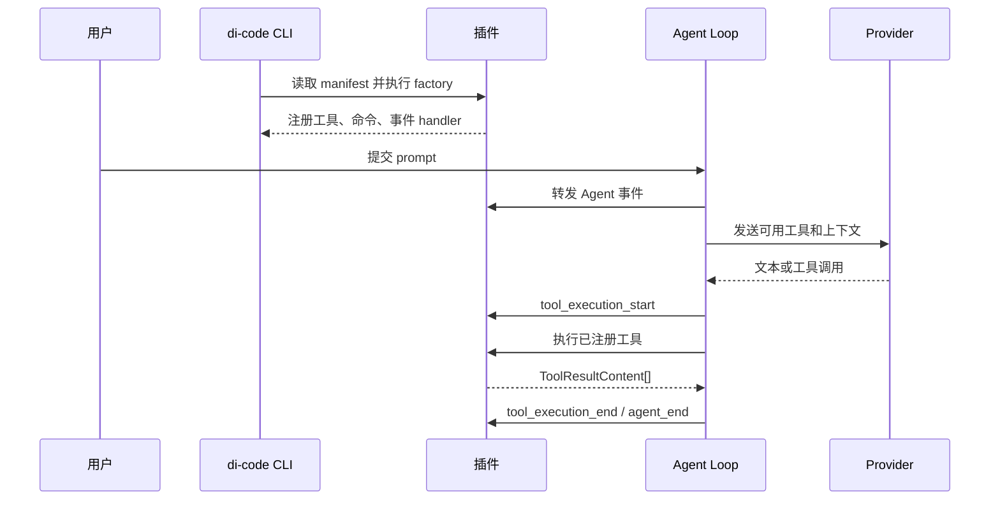

# di-code 插件使用指南

di-code 插件是运行在本地 Node.js 进程中的 ESM 代码。插件可以增加三类能力：供模型调用的工具、interactive 模式 slash command，以及 Agent 和会话生命周期事件处理器。

当前 runtime 宿主还支持 prompt section、工具 middleware、frontend/subagent provider 和显式 Session projection。每次 Provider 请求都会解析一份不可变贡献快照；运行时注册变化只影响后续请求。插件 scope 关闭会按注册逆序释放资源，并聚合清理错误。普通注册不会写入 Session JSONL，插件状态必须通过宿主的显式 projection API 转换为 JSON 数据。

interactive frontend 使用 `registerInteractiveFrontend()` 声明。frontend 由用户通过 `di-code --profile terminal --ui <id>` 显式选择后成为当前 Session 唯一的终端所有者；它通过 `InteractiveController` 接收结构化事件并提交动作，不能自行调用 Agent、读取进程 stdio 或写 Session JSONL。内置 ANSI UI 的 ID 为 `builtin`，由 `@di-code/coding-agent` 的 `BuiltinInteractiveFrontend` 提供。所选 ID 未注册、factory 失败或返回对象缺少生命周期方法时启动失败，不会回退到内置 UI。

### 编写 interactive frontend

完整 frontend 必须在 `start()` 中仅使用宿主传入的 `terminal`，并在用户退出时取消订阅、停止终端后才 resolve。`InteractiveController` 的 `state` 和事件包含流式消息、工具状态、队列、用量和诊断；输入只能通过它的 `submit()`、`steer()`、`cancel()`、命令、模型、Session 与压缩方法回到运行时。完整 frontend 应实现多行输入、流式输出、工具状态、取消、重试、slash command、模型/Session 选择和压缩；`capabilities` 记录已实现能力，供宿主与用户判断可选降级。

```ts
import type { PluginApi } from "@di-code/plugin-runtime";

export default function acmeTerminal(api: PluginApi) {
  api.registerInteractivePanel({ id: "acme-status", title: "Acme", data: { connected: true } });
  api.registerInteractiveFrontend({
    id: "acme-terminal",
    displayName: "Acme terminal",
    capabilities: ["streaming", "tool-status", "cancel", "retry", "commands", "model-selection", "session-selection", "compaction"],
    create: () => ({
      start: async (controller, terminal) => new Promise<void>((resolve) => {
        const subscription = controller.subscribe((event) => terminal.write(`${event.type}\r\n`));
        terminal.start((input) => {
          if (input === "\u0003") {
            controller.cancel();
            subscription.dispose();
            terminal.stop();
            resolve();
          }
        }, () => {});
      }),
      dispose: async () => {}
    })
  });
}
```

普通插件不应注册完整 frontend。它们可用 `registerInteractivePanel()` 提供只读面板数据，或用 `registerToolDetailRenderer()` 为某个已完成工具结果返回文本；选中的 frontend 从 `controller.ui` 读取这些贡献并决定布局。面板和 renderer 没有输入焦点、终端对象、Provider、Session JSONL 或 Agent 私有状态。

本文按“先跑起来，再理解完整接口”的顺序说明。当前插件 API 版本为 `1`。

## 功能范围

插件适合把项目内已有的信息或受控操作接入 Agent，例如读取经过校验的项目状态、调用团队内部 API、记录工具调用审计。

| 已支持 | 当前未支持 |
| --- | --- |
| 本地 TypeScript/JavaScript 插件 | MCP Server 插件接口 |
| 模型工具、slash command、生命周期事件、显式选择的完整 frontend | 热重载、插件市场、自定义 Provider、多个 frontend 同时运行 |
| 项目本地插件和已安装的全局插件 | 用户登录态、用户级工具授权、服务端 Agent API |
| manifest 校验、入口路径保护、加载诊断 | 真正的文件、网络、进程权限沙箱 |
| 启动时的项目 trust 决定是否 import 项目插件 | 用户自定义权限的运行时强制执行 |

`permissions` 是作者声明和审计信息，不会限制 Node.js 代码。只安装可信来源的插件；项目插件必须先由使用者信任。交互式 TTY 首次发现项目插件目录时会询问一次，非交互模式默认不加载。

## 5 分钟快速入门

以下例子创建项目本地插件。它注册 `project-status__summary` 工具，模型调用该工具后会得到项目目录和当前模式。

### 1. 创建插件目录和 manifest

在需要使用插件的项目根目录创建：

```text
my-project/
  .di-code/
    plugins/
      project-status/
        plugin.json
        src/
          index.ts
```

`plugin.json`：

```json
{
  "apiVersion": 1,
  "id": "project-status",
  "name": "Project Status",
  "version": "0.1.0",
  "entry": "./src/index.ts",
  "permissions": {
    "filesystem": "none",
    "network": [],
    "process": []
  }
}
```

`id` 只能包含小写字母、数字和单个连字符。它决定工具命名空间：本例全部插件工具必须以 `project-status__` 开头。

示例使用 TypeBox 构造工具参数 schema。项目插件应从插件所在项目的依赖中解析它：

```powershell
Set-Location D:\work\my-project
npm install --save-dev @di-code/ai @di-code/coding-agent --ignore-scripts
```

已发布插件则把运行时使用的 `@di-code/ai` 写入自身 `dependencies`。`ExtensionAPI` 是类型导入，编译后不会作为运行时 import 保留。

### 2. 编写入口

`src/index.ts`：

```ts
import { Type } from "@di-code/ai";
import type { ExtensionAPI } from "@di-code/coding-agent";

export default function projectStatusPlugin(api: ExtensionAPI) {
  api.registerTool({
    name: "project-status__summary",
    description: "Return the current project directory and di-code running mode.",
    parameters: Type.Object({}),
    execute: async (_toolCallId, _parameters, signal, ctx) => {
      if (signal?.aborted) return [{ type: "text", text: "Cancelled." }];
      return [{ type: "text", text: `Project: ${ctx.cwd}\nMode: ${ctx.mode}` }];
    }
  });
}
```

入口必须默认导出一个 factory 函数。di-code 调用它时传入 `api`，插件通过 `api` 注册能力；factory 可以是同步或异步函数。

工具的 `parameters` 是 TypeBox schema；它会转换为 Provider 可用的 JSON Schema。模型发起工具调用后，宿主先按 schema 校验参数，再调用 `execute`。工具结果目前只能返回文本块或图片块，最常见的是：

```ts
[{ type: "text", text: "要交给模型的结果" }]
```

### 3. 信任并验证

项目插件会执行项目目录中的 Node.js 代码，首次加载前必须授予项目级信任：

```powershell
Set-Location D:\work\my-project
di-code --trust-project --interactive
```

在对话中明确要求模型调用工具：

```text
调用 project-status__summary 工具，并只报告它返回的内容。
```

模型是否调用工具由模型决定；工具名称清楚、描述具体、请求明确时最容易验证。interactive 启动会先显示插件的 `[loading]`，并在完成时原位替换为 `[ok]` 或 `[error]`；非交互模式或需要完整诊断时，查看终端 stderr 的 `plugin_diagnostic` 记录，后文有排查表。

撤销项目级信任：

```powershell
di-code --untrust-project --interactive
```

撤销后，`.di-code/plugins/` 不会被 import；已启用的全局托管插件仍可加载。

## 插件在 Agent 中的位置

插件不是独立 Agent。CLI 启动时加载插件，插件注册的能力随后由同一个 `AgentSession` 使用。



`tool_call_start`、`text_delta` 等是 Provider 流事件，插件通过统一的 `message_update` 观察它们。真正开始和结束执行一个工具时，插件收到的是 `tool_execution_start` 和 `tool_execution_end`。

## 三种插件能力

### 模型工具

使用 `api.registerTool()` 注册。工具会和内置 `read`、`write`、`edit`、`bash` 一起发送给 Provider；模型选择后，Agent Loop 校验参数并调用 `execute`。

```ts
import { Type } from "@di-code/ai";

api.registerTool({
  name: "project-status__find-ticket",
  description: "Find a read-only project ticket by its exact ID.",
  parameters: Type.Object({ id: Type.String({ minLength: 1 }) }),
  execute: async (toolCallId, parameters, signal, ctx) => {
    if (signal?.aborted) return [{ type: "text", text: "Cancelled." }];
    void toolCallId;
    return [{ type: "text", text: `Ticket ${parameters.id} belongs to ${ctx.cwd}.` }];
  }
});
```

| 规则 | 原因 |
| --- | --- |
| 名称使用 `<plugin-id>__<tool-name>` | 避免不同插件和内置工具重名；不符合时拒绝注册。 |
| `description` 写清动作、输入和结果 | Provider 根据它决定是否调用。 |
| `parameters` 收紧为实际需要的字段 | 宿主在调用前校验，减少不可信输入。 |
| 检查 `signal?.aborted` | 用户取消时，长操作应尽快停止。 |
| 返回 `ToolResultContent[]` | 结果会成为后续 Agent 上下文的一部分。 |

“只读工具”是当前公共 API 的定位，不等于 Node.js 沙箱。需要写文件、执行命令或访问网络的插件必须自行处理输入校验、路径边界、超时、取消和错误语义。

### Slash command

使用 `api.registerCommand()` 注册，只能在 interactive 模式输入，格式是 `/<name> [args]`：

```ts
api.registerCommand({
  name: "project-status",
  description: "Run the project-status plugin command.",
  handler: async (ctx) => {
    const requestedAction = ctx.args.trim();
    if (ctx.signal?.aborted) return;
    void requestedAction;
  }
});
```

终端输入 `/project-status refresh` 时，`ctx.args === "refresh"`。当前 command API 没有向 TUI 写自定义消息的方法；它适合触发受控副作用或更新插件自己的外部状态。handler 抛出的错误会显示在 interactive UI 中。

以下内建名称不能使用：

```text
help, clear, model, session, theme, settings, compact, usage, retry
```

### 生命周期事件

使用 `api.on()` 注册。handler 按“插件加载顺序，再按同一插件注册顺序”串行执行；一个 handler 抛错不会中断主会话，而是写入插件诊断。

```ts
api.on("tool_execution_end", async (event, ctx) => {
  if (event.toolName !== "project-status__find-ticket") return;
  if (ctx.signal?.aborted) return;
  // 这里适合写插件自己的审计逻辑，不要记录凭据。
  void event.result;
});
```

事件是观察机制，不是权限拦截器。`tool_execution_start` 发生时，Agent 已开始执行工具；需要拒绝条件时，把检查写进工具自身的 `execute`。

## Agent 全部阶段和事件表

一次 Session 先触发一次 `session_start`，随后每个 prompt 触发一段 Agent Loop。工具调用会令 Agent 开始新的 turn，直到 Provider 给出最终回答。实际事件因是否流式输出、是否调用工具而变化。

| 顺序/阶段 | 事件 `type` | 主要数据 | 适合做什么 |
| --- | --- | --- | --- |
| Session 启动 | `session_start` | `cwd` | 初始化插件的会话内状态。 |
| Agent 开始处理 prompt | `agent_start` | 无额外字段 | 建立本次运行的观测记录。 |
| 一个模型 turn 开始 | `turn_start` | 无额外字段 | 统计模型轮次；工具结果返回模型后会有新 turn。 |
| 一条消息开始 | `message_start` | `message`：用户消息、助手预览或工具结果 | 建立流式消息边界。 |
| Provider 流式更新 | `message_update` | `event` | 观察文本、思考或工具调用片段。 |
| 一条消息完成 | `message_end` | 完整 `message` | 读取最终助手文本或工具结果。 |
| 工具将要执行 | `tool_execution_start` | `toolCallId`、`toolName`、已解析 `arguments` | 记录调用开始时间；不是授权门禁。 |
| 工具完成 | `tool_execution_end` | `toolCallId`、`toolName`、`result` | 审计成功或失败结果、计算耗时。 |
| 一个模型 turn 完成 | `turn_end` | `message`、本 turn 的 `toolResults` | 处理最终文本或确认本轮工具结果。 |
| Agent 运行结束 | `agent_end` | `messages` | 汇总本次 prompt 的结果。 |
| Session 关闭 | `session_shutdown` | `reason`：`user` 或 `error` | 释放插件管理的资源。 |

`message_update.event.type` 的全部可观察值：

| 流事件 | 含义 |
| --- | --- |
| `text_start` / `text_delta` / `text_end` | 助手文本块开始、追加片段、结束。 |
| `thinking_start` / `thinking_delta` / `thinking_end` | Provider 输出思考块时的对应阶段；Provider 不提供时不会出现。 |
| `tool_call_start` / `tool_call_delta` / `tool_call_end` | 模型正在生成工具调用。只有 `tool_call_end` 给出完整且已校验的调用内容。 |

Provider 的 `start`、`done`、`error` 流事件不会作为 `message_update` 转发。插件应以 `message_start`、`message_end`、`agent_end` 和异常诊断判断外层生命周期。

## `ctx`：每个插件回调可使用的上下文

工具、command 和 event handler 都会收到 `ExtensionContext`；command 额外收到 `args`。不要假定其中存在用户、Provider、会话历史、插件 manifest 或 UI 对象，当前 API 没有提供这些字段。

| 字段/方法 | 类型或结果 | 可用位置 | 用途和限制 |
| --- | --- | --- | --- |
| `ctx.cwd` | `string` | 工具、command、事件 | 本次 Agent 允许项目根目录的绝对路径。读取项目文件前仍要自己限制目标路径。 |
| `ctx.mode` | `"interactive" \| "print" \| "json"` | 工具、command、事件 | 可按模式调整行为；slash command 只在 interactive 模式运行。 |
| `ctx.signal` | `AbortSignal \| undefined` | 工具、事件；command 通常为 `undefined` | 监听取消；长任务应检查 `aborted` 并向下传递。 |
| `ctx.isProjectTrusted()` | `boolean` | 工具、command、事件 | 返回当前项目是否受信任；它不是插件权限系统，也不代表某个文件可读取。 |
| `ctx.abort()` | `() => void` | 工具、command、事件 | 为嵌入宿主预留的取消回调。当前 CLI 加载器未接入它，不能依赖它停止 prompt。 |
| `ctx.args` | `string` | 仅 command handler | slash command 名称之后的原始参数，插件必须自行解析和校验。 |

工具还有前三个位置参数：

```ts
execute: async (toolCallId, parameters, signal, ctx) => {
  // toolCallId: 与 tool_execution_* 和工具结果关联的调用 ID
  // parameters: 已通过注册 JSON Schema 校验的对象
  // signal: 与 ctx.signal 对应的本次调用取消信号
  // ctx: 上表中的 ExtensionContext
}
```

`parameters` 只符合声明的 schema，并不天然安全。路径、URL、命令片段和查询表达式仍是不可信输入，必须在插件内按真实目标继续校验。

## 完整插件示例：三种能力一起使用

下面的入口同时注册工具、command 和事件 handler：

```ts
import { Type } from "@di-code/ai";
import type { ExtensionAPI } from "@di-code/coding-agent";

export default function projectStatusPlugin(api: ExtensionAPI) {
  api.registerTool({
    name: "project-status__summary",
    description: "Return the current project directory and running mode.",
    parameters: Type.Object({}),
    execute: async (_toolCallId, _parameters, signal, ctx) => {
      if (signal?.aborted) return [{ type: "text", text: "Cancelled." }];
      return [{ type: "text", text: `Project: ${ctx.cwd}\nMode: ${ctx.mode}` }];
    }
  });

  api.registerCommand({
    name: "project-status",
    description: "Run a project-status action in interactive mode.",
    handler: async (ctx) => {
      const action = ctx.args.trim();
      if (ctx.signal?.aborted) return;
      void action;
    }
  });

  api.on("tool_execution_end", async (event, ctx) => {
    if (event.toolName !== "project-status__summary" || ctx.signal?.aborted) return;
    void event.result;
  });
}
```

模型调用 `project-status__summary` 时，顺序为：`tool_call_*` 流事件 -> `tool_execution_start` -> `execute` -> `tool_execution_end` -> 工具结果进入下一轮模型 turn。工具不应从 `tool_call_delta` 读取参数，也不应自行启动另一轮 Agent。

## manifest、加载位置和安装

### 项目本地插件

固定目录：

```text
<项目根目录>/.di-code/plugins/<插件 ID>/
```

本地 `entry` 支持 `.ts`、`.js` 和 `.mjs`。TypeScript 入口由内置 `jiti` 加载，支持标准 ESM 和相对 import；不承诺 `tsconfig` path alias、Babel 配置或 bundler 专用转换。

项目插件只有在当前目录或祖先目录的 trust 决策为允许时才加载。交互式 TTY 首次发现项目插件目录时会询问一次；`--trust-project` / `--untrust-project` 可显式保存决策。它不会给插件额外 Node.js 权限。

### 已发布包和全局托管插件

发布包应构建为 JavaScript，并在 `package.json` 声明一个入口：

```json
{
  "name": "@acme/di-code-project-status",
  "version": "1.0.0",
  "type": "module",
  "dependencies": {
    "@di-code/ai": "^0.1.1"
  },
  "diCode": {
    "apiVersion": 1,
    "plugins": ["./dist/index.js"],
    "permissions": {
      "filesystem": "none",
      "network": [],
      "process": []
    }
  }
}
```

`diCode.plugins` 当前必须恰好有一个入口。运行时依赖写在插件包自己的 `dependencies`。全局插件管理命令：

```powershell
di-code plugin install D:\work\my-plugin
di-code plugin install npm:@acme/di-code-project-status@1.0.0
di-code plugin install git:https://github.com/acme/di-code-project-status.git
di-code plugin list
di-code plugin disable project-status
di-code plugin enable project-status
di-code plugin update project-status
di-code plugin remove project-status
```

安装固定使用 `npm --ignore-scripts`。普通 Agent 对话不会自动安装或更新插件；只有启用的全局托管插件会在启动时加载。

### manifest 字段和权限声明

| 字段 | 必填 | 规则 |
| --- | --- | --- |
| `apiVersion` | 是 | 当前只能为 `1`。 |
| `id` | 是 | 最长 64 个字符；小写字母、数字和单连字符。 |
| `name`、`version` | 是 | 非空字符串。 |
| `entry` | 是 | 相对插件根目录的文件；不能是绝对路径、`..` 穿越或越出根目录的 symlink。 |
| `permissions.filesystem` | 是 | `none` 或 `read-project`。 |
| `permissions.network` | 是 | 绝对 HTTPS URL 数组。 |
| `permissions.process` | 是 | 精确命令名数组，不允许通配符。 |

这些权限只做格式校验与审计，**不是运行时强制策略**。`filesystem: "none"` 不能阻止恶意 Node.js 插件调用 `node:fs`；网络与进程声明同理。项目 trust 仅决定是否 import 项目代码，也不会形成沙箱。

## 安全边界和作者责任

插件和 CLI 处于同一个本机信任边界。实现真实读文件、运行命令或网络调用时，插件必须自行处理：

| 场景 | 插件必须自行处理 |
| --- | --- |
| 项目文件读取 | 解析为绝对路径后校验仍在允许根内；处理 symlink 逃逸、文件大小和编码。 |
| 子进程 | 使用固定命令和结构化参数，不拼接 shell 字符串；设置超时、cwd、输出截断和取消。 |
| 网络请求 | 固定或严格校验 URL/host；设置超时；不把凭据放进工具结果、错误或日志。 |
| 外部输入 | JSON Schema 后继续校验业务规则，例如 ID 所属范围、路径和分页上限。 |
| 取消 | 检查 `AbortSignal`，并在下游 API 支持时向下传递。 |

事件 handler 异常会被隔离，诊断会对 `token=`、`secret=`、`authorization=`、`api_key=` 等常见模式的值脱敏。插件作者仍不应把凭据拼接到错误消息。

## 诊断与排查

非交互模式把插件加载问题写到 stderr，每行一个 JSON 记录：

```json
{
  "type": "plugin_diagnostic",
  "stage": "manifest",
  "severity": "error",
  "sourcePath": "D:\\work\\my-project\\.di-code\\plugins\\broken\\plugin.json",
  "message": "plugin manifest is not valid JSON"
}
```

| 现象 | 常见原因 | 先检查 |
| --- | --- | --- |
| 项目插件没有加载 | 项目未信任或目录错误 | 在交互式启动时确认 trust 提示，或运行 `di-code --trust-project --interactive`；确认路径和 `plugin.json`。 |
| 工具未出现 | 未使用 `<plugin-id>__` 前缀，或与已有工具冲突 | 检查 `id`、工具名和 stderr 诊断。 |
| slash command unknown | command 未注册、名称冲突，或不在 interactive 模式 | 检查 `registerCommand` 和 `/name`。 |
| 插件导入失败 | 默认导出不是 factory，或 TypeScript/ESM 出错 | 使用 `export default function(api) {}`，先运行类型检查。 |
| `plugin entry must stay inside` | `entry` 路径穿越或 symlink 越出根 | 将入口和依赖放在插件根目录内。 |
| event handler 没有阻止工具 | 事件只观察，不是授权门禁 | 将拒绝条件写进工具 `execute`。 |

## 发布前核对

仓库开发时运行：

```powershell
Set-Location D:\pi\di-code
npm run check
npm run test --workspace @di-code/coding-agent
```

交付插件前确认：

- `plugin.json` 或 `package.json.diCode` 与实际 ID、入口和版本一致。
- 每个模型工具都有 `<plugin-id>__` 前缀、准确 schema 和具体描述。
- 工具处理取消、无效输入、超时与外部失败，不把凭据写入结果。
- 项目插件仅在用户信任项目后加载；交互式启动会在首次发现时询问，也可明确执行 `--trust-project`。
- command 不依赖当前未提供的 TUI 输出能力。
- 生命周期 handler 只做观察、记录和清理，不充当工具授权拦截器。

## 公共 API 与源码导航

插件只从公共包根入口导入类型和 TypeBox 工具 schema：

```ts
import { Type } from "@di-code/ai";
import type { ExtensionAPI, ExtensionContext } from "@di-code/coding-agent";
```

不要从 `src`、`dist` 或内部文件路径导入。需要确认实现时可查看：

- `packages/coding-agent/src/extensions/types.ts`：插件公开类型、`ctx` 和事件映射。
- `packages/coding-agent/src/extensions/runtime.ts`：注册冲突、参数校验、handler 隔离和诊断。
- `packages/coding-agent/src/plugins/manifest.ts`：manifest 字段、权限声明和入口路径校验。
- `packages/agent/src/types.ts`：`AgentEvent` 与 `message_update` 数据结构。
