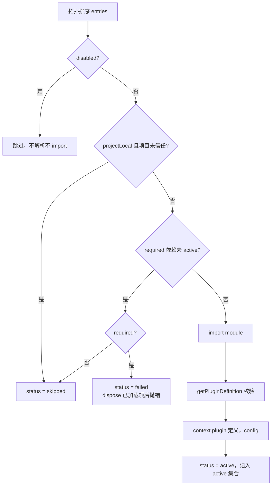

# di-code 架构与插件系统详解

本文面向想理解 **di-code 源码如何组织、插件机制如何实现** 的开发者。它解释"这个系统由哪几层组成"和"每一层内部如何运转"，并把结论落到具体文件、类型和命令上，便于对照源码阅读。

> 本文讨论实现原理。普通使用方法见根目录 [`README.md`](../README.md)；编写第三方插件见 [`插件使用指南.md`](./插件使用指南.md)；贡献流程和扩展位置见 [`开发教程.md`](./开发教程.md)。本文不复述这三份文档的操作性内容，只在需要时链接它们。

## 1. 全景：di-code 在做什么

di-code 是一个以终端为主要界面的 TypeScript AI Coding Agent。它执行的核心循环是：

```text
用户 prompt
   ↓
追加 user message 到对话历史
   ↓
Provider.stream() 流式返回 assistant 消息
   ↓
assistant 包含 tool_call？
   ├─ 是 → schema 校验参数 → 执行工具 → 追加 tool_result → 回到"发起下一轮请求"
   └─ 否 → 循环结束，输出最终消息
```

这个循环有四条不变量（源码层见 `packages/agent/src/agent-loop.ts`）：

1. Provider 只负责把厂商响应转换为统一的 `StreamEvent`，不执行工具。
2. 工具参数在执行前必须经过运行时 schema 校验，不能相信模型输出。
3. 工具错误不是进程崩溃，而是编码为 `isError: true` 的工具结果，模型可以看到并调整下一步。
4. 跨异步边界传递 `AbortSignal`，取消后不启动新的网络请求或工具操作。

产品的一个显著特点是：**默认体验本身也是用插件机制装配出来的**。Provider、编码工具、会话存储、CLI 模式、TUI 渲染、RPC、MCP 和 Skills 都不是 `main.ts` 里硬编码的 `import` + `new`，而是 composition 文件中的 entry。理解了插件系统，就理解了整个产品的组装方式。

## 2. 包结构与依赖方向

仓库是 npm workspaces 单仓库（monorepo），每个 `packages/*` 目录是独立的 ESM TypeScript 包。包之间只允许单向依赖：

```text
（无产品依赖）
  ai ──────────────► agent
                        │
                        ▼
              plugin-runtime ◄── plugin-loader ◄── plugin-sdk
                        ▲               ▲            │
                        │               │            │
                     builtins ◄─────────┴────────────┘
                        ▲
        coding-agent ───┤（同时组装 agent、ai、tui、skills、mcp）
                        ▼
                  orchestrator（只通过公开 RPC 协议）
```

| 包 | 职责 |
| --- | --- |
| `@di-code/ai` | Provider 无关的消息、模型、工具 Schema、流式事件类型；实现 OpenAI、Anthropic、DeepSeek、Kimi、智谱和 Faux 适配器。不知道文件系统、CLI 或终端 UI。 |
| `@di-code/agent` | 对话历史管理和唯一的模型-工具循环。不知道具体 Provider，也不读写文件。 |
| `@di-code/plugin-runtime` | `Context`、`Fiber`、typed service key、生命周期状态、事件、能力视图和诊断脱敏。插件机制的"操作系统"。 |
| `@di-code/plugin-loader` | namespace module 校验、package `diCode` manifest、声明式 Composition、项目信任、受管插件安装。插件机制的"装配器"。 |
| `@di-code/plugin-sdk` | 第三方插件的稳定公开入口，只重导出上面两个包的根 API。 |
| `@di-code/builtins` | 内建功能的 namespace entries：每个 Provider、每个工具、Session、压缩、命令、模式、RPC 都是独立 entry。 |
| `@di-code/coding-agent` | 可执行产品层：CLI bootstrap、默认 composition、MCP entry、受管插件管理、产品会话。 |
| `@di-code/mcp` | Provider 无关的 MCP 客户端与 stdio / Streamable HTTP transport。 |
| `@di-code/skills` | SKILL.md 的 frontmatter 解析、发现和 `/skill:` 参数展开；不执行 Skill 内容。 |
| `@di-code/tui` | ANSI 终端渲染组件库，不依赖任何业务层。 |
| `@di-code/orchestrator` | 通过公开 RPC SDK 监督 `di-code-rpc` 子进程，不导入 coding-agent 内部模块。 |

判断"新代码该放哪一层"的快捷规则：

- 模型流事件增加字段 → `ai`
- 工具循环的行为 → `agent`
- 生命周期、服务所有权 → `plugin-runtime`
- 加载、校验、组合 → `plugin-loader`
- 一个具体能力（Provider、工具、命令）→ `builtins` 或产品 entry（`coding-agent`）
- 终端渲染 → `tui`

## 3. 插件系统：三层分工

插件系统由三个包构成，职责严格分离：

```text
plugin-sdk      第三方唯一入口（稳定 API 面）
   │  依赖
   ▼
plugin-loader   "装什么"：manifest 校验、Composition 合并、依赖排序、trust、安装
   │  依赖
   ▼
plugin-runtime  "怎么活"：Context、ServiceKey、Fiber 生命周期、事件、能力、脱敏
```

- **plugin-runtime 回答运行时问题**：插件实例怎么创建、服务怎么注册和回收、失败怎么回滚、卸载顺序是什么。
- **plugin-loader 回答装配问题**：一个插件包是否合法、它和别的 entry 的顺序关系、disabled 项怎么处理、项目配置是否可信任。
- **plugin-sdk 只做一件事**：把前两者的公开 API 汇成一个入口，让第三方插件不用（也不能）依赖内部包路径。

下面分别展开。

## 4. plugin-runtime：Context、ServiceKey 与 Fiber

源码：`packages/plugin-runtime/src/index.ts`（单文件实现全部基元）。

### 4.1 ServiceKey：类型化的服务句柄

```ts
export type ServiceKey<T> = symbol & { readonly __serviceType?: T };

export function createServiceKey<T>(description: string): ServiceKey<T> {
	return Symbol(description) as ServiceKey<T>;
}
```

服务用一个 symbol 键标识，泛型参数 `T` 在编译期约束读写的类型一致。注册中心不允许同名键重复注册（见 4.3）。这是所有跨插件通信的基础：Provider 注册表、工具注册表、会话工厂……全部通过 `createServiceKey` 暴露句柄，消费者用 `context.get(key)` / `context.require(key)` 获取。

### 4.2 Context：服务和事件的访问边界

```ts
export interface Context {
	readonly id: string;
	readonly parent?: Context;
	readonly signal: AbortSignal;        // 取消信号，dispose 时触发
	readonly mode: RuntimeMode;          // "interactive" | "print" | "json" | "rpc" | "test"
	readonly events: RuntimeEventBus;    // 同步生命周期事件
	readonly services: ServiceRegistry;
	readonly capabilities: CapabilityView;
	readonly logger: PluginLogger;       // 已脱敏的分级日志
	get<T>(key: ServiceKey<T>): T | undefined;
	require<T>(key: ServiceKey<T>): T;   // 缺失时抛错
	set<T>(key: ServiceKey<T>, value: T): Disposer;
	child(options?: ContextChildOptions): Context;
	plugin<TConfig>(definition: PluginDefinition<TConfig>, config: TConfig): Promise<Fiber>;
	dispose(): Promise<void>;
}
```

两条可见性规则：

- **普通 child 继承父 Context 的服务**：`get` 先查本地，查不到且未隔离时向父级冒泡。
- **`child({ isolate: true })` 不继承**：用于 Session 等私有作用域，防止两个会话互相看到对方的服务。

`Context.dispose()` 的顺序是固定的：先 abort 自己的 `AbortController`，再**逆序** dispose 所有子 Context，然后**逆序** dispose 所有 Fiber，最后清空本 Context 的服务记录；每一步的错误都被收集，最终聚合成一个 `AggregateError` 抛出，不会因为单个清理失败而跳过其余清理。

### 4.3 Fiber：一个插件实例的生命周期

每次 `context.plugin(definition, config)` 都创建一个 Fiber。Fiber 状态机：

```text
pending ──start()──► loading ──apply 完成──► active
                        │                      │
                        │ apply 抛错            │ dispose()
                        ▼                      ▼
                     failed ◄──cleanup─── unloading ──► disposed
```

关键实现细节（`RuntimeFiber`）：

- **apply 期间注册的服务对外不可见**。`ServiceRegistry` 中的记录带 `published` 标志，只有 Fiber 进入 `active`（`commit`）后才发布。因此不存在"消费者拿到半初始化服务"的状态。
- **apply 失败自动回滚**。`rollback` 删除该 Fiber 注册的全部服务记录，然后逆序执行已注册的 disposer，状态转为 `failed`，并向事件总线发布 `plugin_error`。
- **迟到注册被拒绝**。Fiber 已进入 `unloading` 或 `disposed` 后再调用 `context.set()` 会抛错，防止异步回调在插件卸载后又留下孤儿服务。
- **dispose 幂等且等待 in-flight setup**。先 abort signal、等待未完成的 `apply`、逆序执行 disposer、回滚服务、转为 `disposed`。disposer 错误聚合上报但不阻断其他清理。
- **apply 返回的清理函数自动挂接**。`apply` 可以返回一个 `Disposer`（也可以用 `fiber.addDisposer` 注册多个），它们都归这个 Fiber 所有。

插件作者的责任对应地写在代码里：timer、listener、HTTP stream、子进程的关闭动作都要注册为 disposer，否则 Fiber 卸载时这些资源不会被释放。

### 4.4 CapabilityView：能力是"门禁 + 审计"，不是沙箱

```ts
export function createCapabilityView(policy: CapabilityPolicy): CapabilityView {
	const declared = new Set<CapabilityName>(); /* 收集 manifest 中为 true 的能力 */
	return {
		trustedProject: policy.trustedProject,
		declared,
		has: (capability) => policy.trustedProject && declared.has(capability),
		require: (capability) => {
			if (!policy.trustedProject) throw new CapabilityDeniedError(capability, "untrusted");
			if (!declared.has(capability)) throw new CapabilityDeniedError(capability, "undeclared");
		},
	};
}
```

五种能力：`filesystem`、`network`、`process`、`ui`、`credentials`。`require()` 同时要求**项目已信任**和**插件已声明**，否则抛出带原因（`"untrusted"` / `"undeclared"`）的 `CapabilityDeniedError`。

必须明确：插件和宿主运行在**同一个 Node 进程**，拥有相同的进程权限。manifest 能力声明的作用是让 Loader 可以在加载前审计、让宿主提供的能力服务可以做运行时检查；它**不构成 Node.js 沙箱**。真正不可信的代码应该放到独立进程桥接，而不是指望声明生效。

### 4.5 事件与诊断脱敏

两套事件 API，用途不同：

- `RuntimeEventBus`：**同步**观察者总线，事件类型为 `plugin_status`、`plugin_error`、`context_created`、`context_disposed`、`runtime_mode`。handler 抛错被捕获吞掉——观察者不能破坏生命周期转换。
- `EventBus<E>`：**异步**类型化总线，按 priority 降序 + 稳定注册顺序调度。普通 handler 失败被隔离并写入诊断；标记 `critical: true` 的 handler 失败才会终止分发并 reject；每个 handler 可设置 `timeoutMs` 和 `AbortSignal` 取消。

诊断通道内置脱敏。`redactSensitiveText` 用正则匹配 `token`、`secret`、`authorization` 和 `api[_-]?key`（即 `apikey`、`api_key`、`api-key` 形式）后的值并替换为 `[REDACTED]`；`PluginLogger` 的 debug/info/warn/error 输出和 `details`、错误消息、错误栈都经过该处理。所以插件往诊断里打日志不会意外泄漏凭据，但插件自己拼的字符串不走这个通道时仍需自行注意。

## 5. plugin-loader：校验、Composition 与安装

源码：`packages/plugin-loader/src/index.ts`。

### 5.1 namespace module 的硬性规则

一个插件 entry 是一个 ESM namespace module。`getPluginDefinition()`（内部经 `unwrapPluginModule()`）在校验后返回定义，规则是：

- 必须导出非空 `name`（匹配 `[A-Za-z0-9][A-Za-z0-9._-]*`）和可调用的 `apply`。
- `apiVersion` 若存在必须为 `1`；`version` 若存在必须是合法版本标识。
- **出现 `default` export 直接拒绝**。这是为了阻止 CommonJS 风格的默认导出混入，也方便工具静态扫描。
- 允许导出一个名为 `plugin` 的嵌套对象作为定义。

### 5.2 package manifest：`diCode` 字段

受管安装的插件必须在 `package.json` 中声明：

```json
{
	"name": "@acme/di-code-project-status",
	"version": "1.0.0",
	"type": "module",
	"exports": {
		"./plugin": { "types": "./dist/plugin.d.ts", "import": "./dist/plugin.js" }
	},
	"diCode": {
		"apiVersion": 1,
		"plugins": ["./plugin"],
		"permissions": {
			"filesystem": "none",
			"network": [],
			"process": []
		}
	}
}
```

Loader 的校验（`readPackagePluginManifest` / `resolvePackagePluginExport`）：

- `diCode.plugins` 必须是**恰好一个**由 `exports` 声明的 entry。
- entry 解析后的目标必须仍在 package root 内，拒绝 `..` 和绝对路径——防止通过深导入逃出包边界。
- `permissions.filesystem` 只接受 `none | read-project | workspace | user | unrestricted`。
- `permissions.network` 只接受绝对 HTTPS URL 列表。
- `permissions.process` 只接受精确命令名列表（正则 `[A-Za-z0-9][A-Za-z0-9-]*`）。

这些格式检查发生在 **import 之前**，非法 manifest 的代码根本不会被加载。

### 5.3 Composition：数据，不是代码

Composition 是 JSON/YAML 文档，描述"装哪些 entry、什么顺序、什么配置"：

```yaml
entries:
  - id: project-status
    name: "@acme/di-code-project-status/plugin"
    dependsOn: ["Bootstrap"]
    required: false
    config:
      label: "${PROJECT_LABEL}"
patches:
  - { op: disable, id: tool-bash }
```

`CompositionEntry` 的字段：`id`（树内唯一）、`name`（模块说明符）、`config`、`dependsOn`（必需依赖）、`optionalDependsOn`（软依赖）、`required`（默认 `true`）、`disabled`、`group`、`projectLocal`。

配置值有三条安全约束（`validateValue` / `resolveEnvironment`）：

- 只接受 JSON/YAML 值；字符串中含 `$(` 或反引号直接拒绝——不允许命令表达式。
- 环境变量插值只支持**整串** `$VAR` 或 `${VAR}` 形式；引用的变量缺失时报错并指出变量名。
- 不执行 shell、不 eval 任何内容。

patch 支持七种操作，全部按 `id` 精确定位：

| 操作 | 参数 | 效果 |
| --- | --- | --- |
| `insert` | `entry` + `after` | 在目标 entry 之后插入 |
| `append` | `entry` | 追加到末尾 |
| `remove` | `id` | 删除 entry |
| `replace` | `id` + `entry`（id 必须一致） | 替换 entry |
| `enable` / `disable` | `id` | 翻转 `disabled` 标志 |
| `move` | `id` + `before`/`after` | 移动位置 |

### 5.4 层级合并：固定顺序，后层覆盖前层

`mergeCompositionLayers()` 给层定义了固定权重：`base`(0) → `mode`(1) → `user`(2) → `project`(3) → `explicit`(4)。合并规则：

- 每层先按 `id` 合并 entries——**后层同 id 直接替换前层**。
- 然后应用该层的 patches，作用于"到此为止"的树。

所以 `~/.di-code/composition.yml` 可以 patch 内建 composition，`--composition` 指定的文件作为最后一层拥有最高优先级。

### 5.5 加载算法：`CompositionLoader.load()` 逐步解析



要点：

- `topologicallySortEntries()` 对 `dependsOn` 做深度优先排序，检测到环抛 `CompositionError("cycle")`；引用不存在的必需依赖抛 `missing-dependency`。
- **required entry 失败是 fail-fast**：Loader 先 `dispose()` 所有已激活的 Fiber（逆序），再抛 `CompositionError("required-failure")`，启动终止。
- **optional entry 失败被隔离**：状态记为 `skipped` 并保留错误信息，不影响兄弟 entry。
- `load()` 返回 `PluginInventory`：每个 entry 的 `entry` + `status` + 可选 `fiber` / `error` 的冻结快照。这就是唯一的生命周期真相来源，没有第二套状态数组。
- `loader.dispose()` 逆序 dispose 全部 Fiber。

### 5.6 项目信任：`ProjectTrustStore`

信任决策保存在 `~/.di-code/trust.json`（version `1` JSON，key 为项目根的 canonical path）。读写细节：

- 写入走临时文件 + `rename`，保证原子性。
- 文件缺失或格式非法都按"无决策"处理，不会让损坏文件挡住启动。
- 交互式 TTY 下，当项目存在需要信任的内容（`.di-code/skills`、`.agents/skills`、`.di-code/mcp.local.json`、`.mcp.json`）时会弹出询问；non-TTY 不等待输入。
- `--trust-project` / `--untrust-project` 显式写入决策；`--no-project-plugins` 只为本次运行跳过项目层，不改变已保存的决策。

信任控制的是**项目本地的 Composition、Skills 和 MCP 配置是否被加载**。它不是插件权限升级，也不影响用户级受管插件的 enabled 状态。

### 5.7 受管插件安装：`PluginInstallManager`

受管插件安装在 `~/.di-code/plugins/installed/`，registry 是同目录下的 `registry.json`（version `1`）。三种安装来源：

```powershell
di-code plugin install D:\work\my-plugin     # 本地路径
di-code plugin install npm:@acme/plugin@1.0.0
di-code plugin install git:https://github.com/acme/plugin.git
```

可靠性机制：

- `npm:` 安装固定使用 `npm install --ignore-scripts`，安装阶段不执行任何依赖生命周期脚本。
- 安装先落到 `.staging-<pid>-<时间戳>` 临时目录，校验通过后再替换；失败时恢复旧安装。
- 所有写操作（install、enable、disable、remove、update）由跨进程目录锁串行化：默认等待 30 秒、每 50ms 重试一次，超时明确失败；超过 5 分钟的遗留锁视为崩溃残留，在下一次写操作前回收。
- `assertManagedPath()` 用 `resolve` + `relative` 确保任何操作目标都在 managed root 内。

`di-code plugin list` 输出 `id<TAB>enabled|disabled<TAB>version`；`di-code plugin get <id>` 输出包含 `id`、`enabled`、`version`、`installedAt` 和能力列表的 JSON，不包含安装路径或来源。

## 6. 产品装配：从命令行到 entry active

这一节把前面的机制串起来，看一次真实启动发生了什么。

### 6.1 启动序列（`packages/coding-agent/src/main.ts`）

```text
parseCliArgs
  ↓
help / version 静态分支
  ↓
读取 ~/.di-code/trust.json，必要时交互询问并持久化
  ↓
resolveManagedCompositionEntries(agentDir)      ← enabled 受管插件 → managed.<id> entry（required: false）
resolveCompositionEntries(profile, ...)          ← base + mode + user + project + explicit 层合并
  ↓
createRootContext({ mode, trustedProject })
  ↓
createCompositionLoader({ context, entries, importer, projectTrusted })
  ↓
await loader.load()                              ← 5.5 的算法
  ↓
context.require(pluginInventoryKey).set(snapshot)
  ↓
context.require(hostCommandRegistryKey).execute(name, input)
  ↓
finally：loader.dispose() → context.dispose() → 内存会话释放
```

注意最后一段：即使命令执行抛错，也先逆序 dispose Loader 和 Context 再返回退出码。资源释放在 `finally` 链里完成。

### 6.2 固定层级与 CLI 选项

```text
base.yml（包内）
  → mode（interactive / print / json / rpc，--profile 或 --mode 选择）
  → ~/.di-code/composition.yml（user 层，缺失则忽略）
  → <work-root>/.di-code/composition.yml（project 层，仅项目已信任时读取）
  → --composition <path>（explicit 层，文件必须可读，否则启动失败）
```

之后追加所有 enabled 的受管插件 entry（`dependsOn: ["Bootstrap"]`，`required: false`）。

### 6.3 base composition 里有什么

`packages/coding-agent/compositions/base.yml` 定义了产品骨架，按功能分组：

| 分组 | entry（id） |
| --- | --- |
| Bootstrap / 基础设施 | `Bootstrap`、`runtime-core`、`composition-loader`、`project-trust`、`command-core`、`cli-parser`、`runtime`、`diagnostics`、`process-exit`、`plugin-manager`、`plugin-inventory` |
| Provider | `provider-registry`、`model-catalog`、`credential-env`、`runtime-selection`、`provider-faux`（required）；`provider-openai` / `provider-anthropic` / `provider-deepseek` / `provider-kimi` / `provider-zhipu` / `provider-onboarding`（全部 `required: false`） |
| 工具 | `tool-registry`、`workspace`、`process`、`network`、`tool-approval`、`tool-policy`、`tool-output`、`tool-read`、`tool-write`、`tool-edit`、`tool-bash`、`tool-glob`、`tool-grep`、`tool-load-skill` |
| 会话 | `session-memory`、`session-store-registry`、`session-migrations`、`session-store-jsonl`、`session-tree`、`session-query` |
| 上下文 | `usage-meter`、`context-budget`、`compaction-basic`、`compaction-tool-result`、`system-prompt`、`resource-loader`、`skills` |
| MCP | `mcp-config`、`mcp-transport`、`mcp-client`、`mcp-tools` |

mode 层在其上追加差异部分：

- **print**：`agent-loop` + `mode-print`
- **json**：`agent-loop` + `output-json` + `mode-json`
- **interactive**：`agent-session`、`session-factory`、`interactive-resources`、`command-session`、`command-model`、`command-settings`、`command-compact`、`command-interactive-core`、`theme`、`interactive-context`、`tui-renderer`、`mode-interactive`、`interactive-host`
- **rpc**：`rpc-client-sdk`、`mode-rpc`、`agent-session`、`session-factory`、`rpc-protocol-v1`、`rpc-server`、`rpc-events`

`--trace-plugins` / `--dump-composition` 会在 mode 层额外追加观测 entries（`plugin-profiler`、`plugin-invariants`、`plugin-test-runtime`、`plugin-trace`、`plugin-dump-composition`），平时不加载。

### 6.4 禁用或替换内建功能

内建功能是 entry，所以用户层文档可以 patch 它们。在 `~/.di-code/composition.yml` 或项目 `.di-code/composition.yml` 中：

```yaml
patches:
  - { op: disable, id: tool-bash }
  - { op: disable, id: provider-kimi }
  - { op: replace, id: session-store-jsonl, entry: { id: session-store-jsonl, name: "@acme/memory-store" } }
```

语义边界：

- `disable` 的 entry **完全不解析、不 import**——被禁代码根本不进入进程。
- 禁用一个被其他 entry `dependsOn` 的项时，依赖它的 entry 会因 missing-dependency 失败：required 依赖者导致启动终止，optional 依赖者记为 `skipped`。因此可以安全禁用的是"叶子"entry（如 `tool-bash`、某个 Provider、MCP 链路），不能禁 `Bootstrap`、`tool-registry` 这类骨架。
- `di-code plugin disable <id>` 只作用于受管安装的第三方插件，不适用于内建 entry。
- 查看当前解析结果用 `di-code --dump-composition`，输出不含 entry 配置值。

### 6.5 观测：`--trace-plugins` 与 `--dump-composition`

这两个命令按需挂载观测 entry，从 `pluginInventoryKey` 读取 Loader 的真实快照后输出 JSON：每个 entry 的 `id`、解析后的模块名、`phase`（即 Loader status）、`required`、依赖列表、owner Fiber（id / 插件名 / 状态）、capability audit（`trustedProject`、`declared`、`granted` 三列表）和脱敏后的失败信息。观测输出不含 entry config、安装路径、凭据或 Provider 请求体。

## 7. 插件如何与 Agent 循环协作

插件可以贡献能力，但不能绕过唯一的 Agent 循环：

- 工具插件把工具注册进 `ToolRegistry`；Agent 循环从 registry 快照里发现工具、校验参数、执行、把 `tool_result` 追加回历史。Agent 不认识具体工具名单。
- Provider 插件向 `ProviderRegistry` 贡献 `@di-code/ai` 的 `Provider`/`Model` 契约；厂商字段不泄漏进 Agent 公共类型。
- 会话存储通过 `SessionStoreRegistry.get("jsonl")` 解析，因此 composition 可以替换持久化实现而不改 Agent 会话工厂。
- 事件 handler 是观察者：普通 handler 失败只写诊断；插件在 handler 里再次调用 Provider、自建循环、把 handler 当工具授权门禁，都是违反架构约束的用法。模型-工具循环只由 `@di-code/agent` 执行一次。

## 8. 安全边界：什么被保证、什么不被保证

| 保证 | 机制 |
| --- | --- |
| 非法 manifest 不被加载 | Loader 在 import 前校验 `diCode` 字段、exports 边界和 namespace export 形状 |
| 配置不执行代码 | Composition 只接受 JSON/YAML 值；`$(`、反引号被拒绝；环境变量只做整串插值 |
| disabled 代码不进入进程 | `load()` 对 disabled entry 直接 `continue` |
| 未信任项目配置不加载 | `projectLocal` + `projectTrusted === false` → `skipped` |
| 安装目录不可逃逸 | `assertManagedPath` + staging + 原子 registry 替换 |
| 诊断不泄漏凭据 | `redactSensitiveText` 覆盖 logger、错误和 details |
| 资源不泄漏 | Fiber 回滚 + 逆序 disposer + Context 聚合清理 |

| 不保证 | 事实 |
| --- | --- |
| 插件被隔离执行 | 插件与宿主同进程，拥有 Node 的全部进程权限；capability 是审计和门禁，不是沙箱 |
| manifest 权限限制插件行为 | 插件可以自行 `import node:fs`；声明不能阻止它 |
| 事件 handler 拦截工具调用 | handler 是观察者，不是授权层 |

真正不可信的代码必须放到独立进程并通过协议桥接；在进程内宣称"安全隔离"是不成立的。

## 9. 常见排查

| 现象 | 检查 |
| --- | --- |
| 启动报 `required entry ... failed` | 用 `di-code --dump-composition` 看 entry 的 `phase` 和 `failure`；通常是 patch 掉了被依赖的项，或 required 依赖自身失败 |
| 插件安装失败 | `package.json` 的 `diCode.plugins`、`exports` 声明和目标是否在 package root 内；`diCode.apiVersion` 是否为 `1` |
| entry 状态是 `skipped` | 该 entry 是 optional 且失败，或 `projectLocal` 但项目未信任，或 required 依赖未 active；看 inventory 里的错误信息 |
| 项目 `.di-code/composition.yml` 不生效 | 项目是否已被 trust（`--trust-project` 或交互确认）；本次运行是否用了 `--no-project-plugins` |
| 服务取不到 | `context.get()` 返回 `undefined` 时是否处于 isolate child；依赖的 entry 是否真的 active；重复注册同名键会直接抛错 |
| 插件清理不生效 | timer、listener、进程的关闭是否注册为 disposer；异步回调是否检查了 Fiber 状态（迟到注册会被拒绝） |

## 10. 延伸阅读

- [README.md](../README.md)：安装、配置、CLI 选项和用户可观察行为。
- [插件使用指南.md](./插件使用指南.md)：第三方插件的 manifest、Composition、trust、capability 和安全责任。
- [开发教程.md](./开发教程.md)：贡献流程、按模块扩展的正确位置和测试策略。
- 各包 README：`packages/plugin-runtime/README.md`、`packages/plugin-loader/README.md`、`packages/plugin-sdk/README.md`、`packages/builtins/README.md` 等，包含包级 API 和语义。
